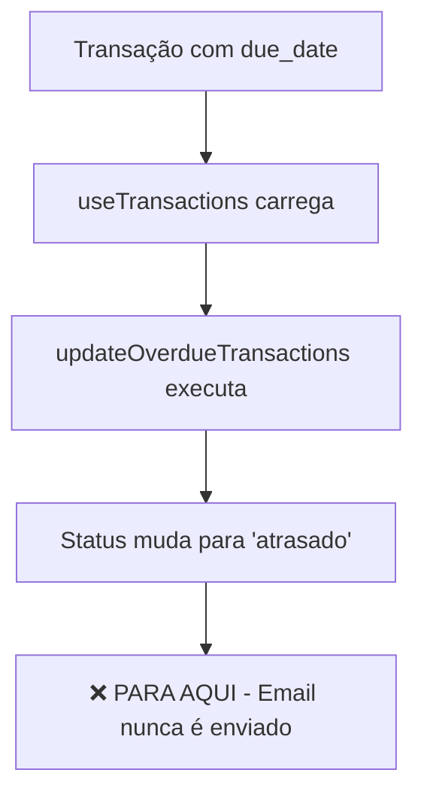
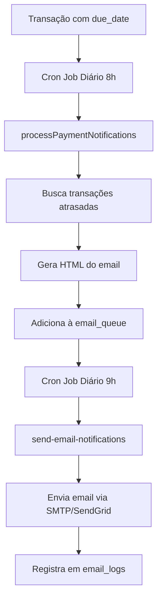

# 🔍 Diagnóstico: Sistema de Notificações de Email

## ❌ PROBLEMA IDENTIFICADO

**A função de notificação NÃO está funcional quando uma fatura fica em atraso.**

---

## 📊 O que existe (Infraestrutura)

### ✅ Tabelas do Banco de Dados
```sql
✓ notification_preferences  - Preferências de notificação do usuário
✓ email_configurations      - Configurações de SMTP/SendGrid/Resend
✓ email_queue              - Fila de emails pendentes
✓ email_logs               - Log de emails enviados
```

### ✅ Edge Function
```typescript
✓ send-email-notifications/index.ts - Processa fila e envia emails
```

### ✅ Serviço Frontend
```typescript
✓ email-notification-service.ts - Templates e função processPaymentNotifications()
```

### ✅ Hook de Transações
```typescript
✓ use-transactions.ts - updateOverdueTransactions() - Atualiza status para 'atrasado'
```

---

## ⚠️ O que NÃO está funcionando

### ❌ Problema 1: Ninguém Chama processPaymentNotifications()
A função `processPaymentNotifications()` existe mas **NUNCA É EXECUTADA**.

**Onde deveria ser chamada:**
1. Por um cron job diário (não existe)
2. Por trigger SQL quando status muda para 'atrasado' (não existe)
3. Por Edge Function agendada (não configurado)

### ❌ Problema 2: Edge Function Não Tem Agendamento
A Edge Function `send-email-notifications` processa a fila, mas:
- Não há cron job configurado para executá-la
- Precisa ser chamada manualmente via HTTP

### ❌ Problema 3: Falta pg_cron
O Supabase suporta pg_cron para tarefas agendadas, mas não está configurado.

---

## 🔄 Fluxo Atual (INCOMPLETO)



## 🔄 Fluxo Esperado (COMPLETO)



---

## 🛠️ SOLUÇÕES

### Solução 1: Cron Job no Supabase (RECOMENDADO) ⭐

**Arquivo:** `supabase/migrations/20250112100000_setup_notification_cron.sql`

```sql
-- Habilitar extensão pg_cron se ainda não estiver habilitada
CREATE EXTENSION IF NOT EXISTS pg_cron;

-- Função para processar notificações de vencimento
CREATE OR REPLACE FUNCTION process_payment_notifications_cron()
RETURNS void
LANGUAGE plpgsql
SECURITY DEFINER
AS $$
DECLARE
  company RECORD;
  transactions_count INTEGER;
  overdue_transactions JSONB;
  due_today_transactions JSONB;
  due_soon_transactions JSONB;
  prefs RECORD;
BEGIN
  -- Iterar sobre todas as empresas
  FOR company IN SELECT DISTINCT id FROM companies LOOP

    -- Buscar preferências de usuários com notificações ativadas
    FOR prefs IN
      SELECT
        np.user_id,
        np.company_id,
        np.days_before_due,
        p.nome as user_name,
        au.email as user_email
      FROM notification_preferences np
      JOIN profiles p ON p.user_id = np.user_id
      JOIN auth.users au ON au.id = np.user_id
      WHERE np.company_id = company.id
        AND np.email_notifications = true
        AND np.due_date_alerts = true
    LOOP

      -- Buscar transações vencidas (overdue)
      SELECT jsonb_agg(jsonb_build_object(
        'id', t.id,
        'description', t.description,
        'amount', t.amount,
        'due_date', t.due_date,
        'transaction_type', t.transaction_type,
        'contact_name', c.name
      ))
      INTO overdue_transactions
      FROM transactions t
      LEFT JOIN contacts c ON c.id = t.contact_id
      WHERE t.company_id = company.id
        AND t.due_date < CURRENT_DATE
        AND t.status IN ('pendente', 'atrasado')
        AND t.due_date IS NOT NULL;

      -- Buscar transações que vencem hoje
      SELECT jsonb_agg(jsonb_build_object(
        'id', t.id,
        'description', t.description,
        'amount', t.amount,
        'due_date', t.due_date,
        'transaction_type', t.transaction_type,
        'contact_name', c.name
      ))
      INTO due_today_transactions
      FROM transactions t
      LEFT JOIN contacts c ON c.id = t.contact_id
      WHERE t.company_id = company.id
        AND t.due_date = CURRENT_DATE
        AND t.status IN ('pendente')
        AND t.due_date IS NOT NULL;

      -- Buscar transações que vencem em N dias
      SELECT jsonb_agg(jsonb_build_object(
        'id', t.id,
        'description', t.description,
        'amount', t.amount,
        'due_date', t.due_date,
        'transaction_type', t.transaction_type,
        'contact_name', c.name
      ))
      INTO due_soon_transactions
      FROM transactions t
      LEFT JOIN contacts c ON c.id = t.contact_id
      WHERE t.company_id = company.id
        AND t.due_date > CURRENT_DATE
        AND t.due_date <= CURRENT_DATE + (prefs.days_before_due || ' days')::INTERVAL
        AND t.status IN ('pendente')
        AND t.due_date IS NOT NULL;

      -- Enfileirar email de vencidos
      IF overdue_transactions IS NOT NULL THEN
        INSERT INTO email_queue (
          user_id,
          company_id,
          to_email,
          subject,
          html_content,
          notification_type,
          scheduled_for
        )
        SELECT
          prefs.user_id,
          prefs.company_id,
          prefs.user_email,
          '🚨 Contas Vencidas - Impulse Financeiro',
          generate_overdue_email_html(overdue_transactions, prefs.user_name),
          'overdue',
          NOW()
        WHERE NOT EXISTS (
          -- Evitar duplicatas: não enviar se já enviou hoje
          SELECT 1 FROM email_logs
          WHERE user_id = prefs.user_id
            AND notification_type = 'overdue'
            AND DATE(sent_at) = CURRENT_DATE
        );
      END IF;

      -- Enfileirar email de vencimento hoje
      IF due_today_transactions IS NOT NULL THEN
        INSERT INTO email_queue (
          user_id,
          company_id,
          to_email,
          subject,
          html_content,
          notification_type,
          scheduled_for
        )
        SELECT
          prefs.user_id,
          prefs.company_id,
          prefs.user_email,
          '📅 Contas Vencendo Hoje - Impulse Financeiro',
          generate_due_today_email_html(due_today_transactions, prefs.user_name),
          'due_today',
          NOW()
        WHERE NOT EXISTS (
          SELECT 1 FROM email_logs
          WHERE user_id = prefs.user_id
            AND notification_type = 'due_today'
            AND DATE(sent_at) = CURRENT_DATE
        );
      END IF;

      -- Enfileirar email de vencimento próximo
      IF due_soon_transactions IS NOT NULL THEN
        INSERT INTO email_queue (
          user_id,
          company_id,
          to_email,
          subject,
          html_content,
          notification_type,
          scheduled_for
        )
        SELECT
          prefs.user_id,
          prefs.company_id,
          prefs.user_email,
          '⏰ Contas a Vencer - Impulse Financeiro',
          generate_due_soon_email_html(due_soon_transactions, prefs.user_name, prefs.days_before_due),
          'due_soon',
          NOW()
        WHERE NOT EXISTS (
          SELECT 1 FROM email_logs
          WHERE user_id = prefs.user_id
            AND notification_type = 'due_soon'
            AND DATE(sent_at) = CURRENT_DATE
        );
      END IF;

    END LOOP;
  END LOOP;

  RAISE NOTICE 'Processamento de notificações concluído';
END;
$$;

-- Agendar execução diária às 8h
SELECT cron.schedule(
  'process-payment-notifications',
  '0 8 * * *',  -- Todo dia às 8h
  'SELECT process_payment_notifications_cron()'
);

-- Comentário
COMMENT ON FUNCTION process_payment_notifications_cron IS 'Processa notificações de vencimento e enfileira emails - Executado diariamente às 8h';
```

---

### Solução 2: Trigger SQL quando Status Muda

```sql
-- Trigger para enfileirar email quando transação fica atrasada
CREATE OR REPLACE FUNCTION enqueue_overdue_notification()
RETURNS TRIGGER
LANGUAGE plpgsql
SECURITY DEFINER
AS $$
DECLARE
  user_email TEXT;
  user_name TEXT;
  prefs RECORD;
BEGIN
  -- Só executar se o status mudou para 'atrasado'
  IF NEW.status = 'atrasado' AND (OLD.status IS NULL OR OLD.status != 'atrasado') THEN

    -- Buscar usuários com notificações ativadas para esta empresa
    FOR prefs IN
      SELECT
        np.user_id,
        p.nome as user_name,
        au.email as user_email
      FROM notification_preferences np
      JOIN profiles p ON p.user_id = np.user_id
      JOIN auth.users au ON au.id = np.user_id
      WHERE np.company_id = NEW.company_id
        AND np.email_notifications = true
        AND np.due_date_alerts = true
    LOOP

      -- Enfileirar email
      INSERT INTO email_queue (
        user_id,
        company_id,
        to_email,
        subject,
        html_content,
        notification_type,
        scheduled_for
      ) VALUES (
        prefs.user_id,
        NEW.company_id,
        prefs.user_email,
        '🚨 Conta Vencida: ' || NEW.description,
        format(
          '<h1>Conta Vencida</h1><p>A transação "%s" no valor de R$ %s está vencida desde %s.</p>',
          NEW.description,
          NEW.amount,
          NEW.due_date
        ),
        'overdue',
        NOW()
      )
      ON CONFLICT DO NOTHING; -- Evitar duplicatas

    END LOOP;

  END IF;

  RETURN NEW;
END;
$$;

-- Criar trigger
CREATE TRIGGER notify_overdue_transactions
  AFTER UPDATE OF status ON transactions
  FOR EACH ROW
  EXECUTE FUNCTION enqueue_overdue_notification();
```

---

### Solução 3: Chamar do Frontend (NÃO RECOMENDADO)

```typescript
// No useEffect do use-transactions.ts
useEffect(() => {
  if (!loading && transactions.length > 0) {
    updateOverdueTransactions();

    // Processar notificações (executar apenas 1x por dia)
    const lastCheck = localStorage.getItem('lastNotificationCheck');
    const today = new Date().toDateString();

    if (lastCheck !== today) {
      processPaymentNotifications(companyId!);
      localStorage.setItem('lastNotificationCheck', today);
    }
  }
}, [transactions.length, loading]);
```

---

## 🎯 SOLUÇÃO RECOMENDADA

**Implementar Solução 1 (Cron Job) + Templates HTML no Banco**

### Vantagens:
- ✅ Totalmente automático
- ✅ Não depende de usuário acessar o sistema
- ✅ Confiável (pg_cron é estável)
- ✅ Escalável (funciona para milhares de empresas)
- ✅ Evita duplicatas
- ✅ Log completo de envios

### Próximos Passos:
1. Aplicar migração com cron job
2. Criar funções de geração de HTML no banco
3. Configurar Edge Function para ser chamada pelo cron
4. Testar envio manual
5. Monitorar logs

---

## 📝 TODO - Para Funcionar Completamente

- [ ] Criar migração com setup de cron
- [ ] Criar funções SQL de geração de HTML
- [ ] Configurar credenciais de email (SMTP/SendGrid)
- [ ] Testar envio manual
- [ ] Configurar cron para chamar Edge Function
- [ ] Adicionar dashboard de monitoramento
- [ ] Documentar para usuários

---

*Diagnóstico realizado em: 2025-01-12*
*Status: ❌ NÃO FUNCIONAL - Requer implementação*
